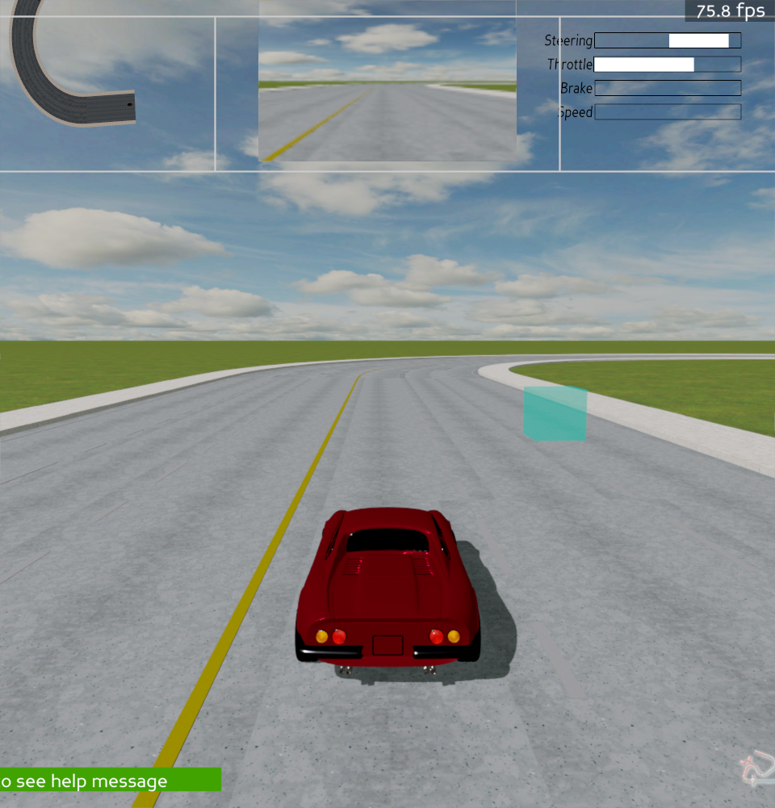

# MetaDrive Tutorials

Are you interested in self-driving cars? Do you want to learn RL? 
If so, look no further! 
In this series of tutorials, we'll teach you how to train an RL model to drive a simulated car in Metadrive, an environment for testing self-driving cars.
We assume only knowledge of basic ML, and will teach you any RL concepts.
To ensure your understanding, we provide coding exercises for you to fill out, as well as solutions to check your work against.

## Screenshots




## Prerequisite Knowledge
Here's a list of the topics you should be familiar with, alongside some sources that you can review them with: 
* Partial Derivatives and Gradients
    * https://www.khanacademy.org/math/multivariable-calculus/multivariable-derivatives/partial-derivative-and-gradient-articles/a/introduction-to-partial-derivatives
    * https://www.khanacademy.org/math/multivariable-calculus/multivariable-derivatives/partial-derivative-and-gradient-articles/a/the-gradient
* Probability Distributions
    * https://www.khanacademy.org/math/statistics-probability/random-variables-stats-library/random-variables-discrete/v/discrete-and-continuous-random-variables
    * https://www.khanacademy.org/math/statistics-probability/random-variables-stats-library/random-variables-continuous/v/random-variables
* Backprop
    * 3Blue1Brown's Backprop Video: https://www.youtube.com/watch?v=tIeHLnjs5U8
    * Andrei Karpathy's Micrograd Video: https://www.youtube.com/watch?v=VMj-3S1tku0 
* PyTorch
    * https://pytorch.org/tutorials/beginner/deep_learning_60min_blitz.html
    * https://pytorch.org/tutorials/beginner/pytorch_with_examples.html


## Installing Metadrive

*Note: Metadrive only officially supports Windows and Linux systems*

The most up-to-date instructions for installing Metadrive can be found on the [Metadrive repository](https://github.com/metadriverse/metadrive) 

We reccomend directly git cloning the latest version of the repository, as it contains recent updates that allow you to use it with newer libraries:

```
git clone https://github.com/metadriverse/metadrive.git
cd metadrive
pip install -e .
```

## Table of Contents

The tutorials build off of each other, so we reccomend reading them in the order listed:

1. [Policy Gradients Explanation](./PolicyGradient/policygradient.ipynb)
    * [Discrete Policy Gradient Exercise](./PolicyGradient/policygradient_discrete_exercise.ipynb)
        * [Discrete Policy Gradient Solution](./PolicyGradient/policygradient_discrete_solution.ipynb)
    * [Continuous Policy Gradient Exercise](./PolicyGradient/policygradient_continuous_exercise.ipynb)
        * [Continuous Policy Gradient Solution](./PolicyGradient/policygradient_continuous_solution.ipynb)
2. [Deep Q Network Explanation](./DQN/dqn.ipynb)
    * [Deep Q Network Exercise](./DQN/dqn_exercise.ipynb)
        * [Deep Q Network Solution](./DQN/dqn_solution.ipynb)
3. [Double and Dueling DQN Explanation](./DQN/double_dueling_dqn.ipynb)
    * [Double and Dueling DQN Exercise](./DQN/double_dueling_dqn_exercise.ipynb)
        * [Double and Dueling DQN Solution](./DQN/double_dueling_dqn_solution.ipynb)
4. [PPO Explanation](./PPO/ppo.ipynb)
    * [PPO Exercise](./PPO/ppo_exercise.ipynb)
        * [PPO Solution](./PPO/ppo_solution.ipynb)


